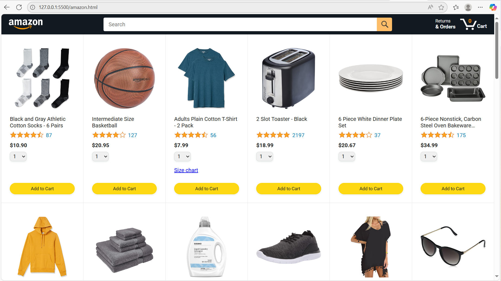
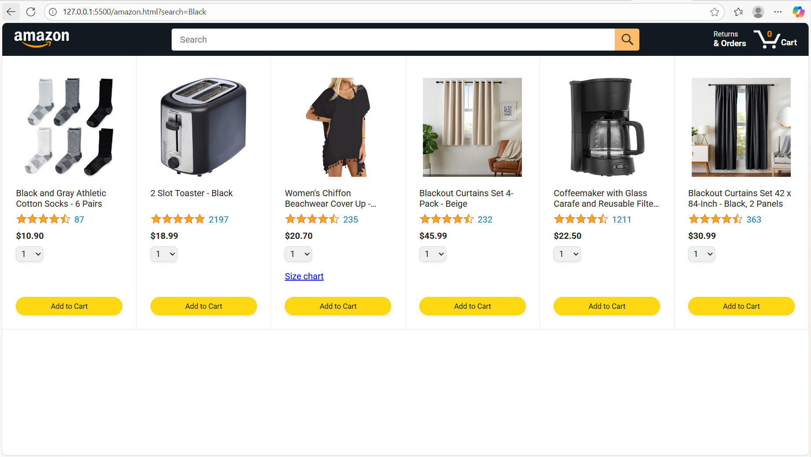
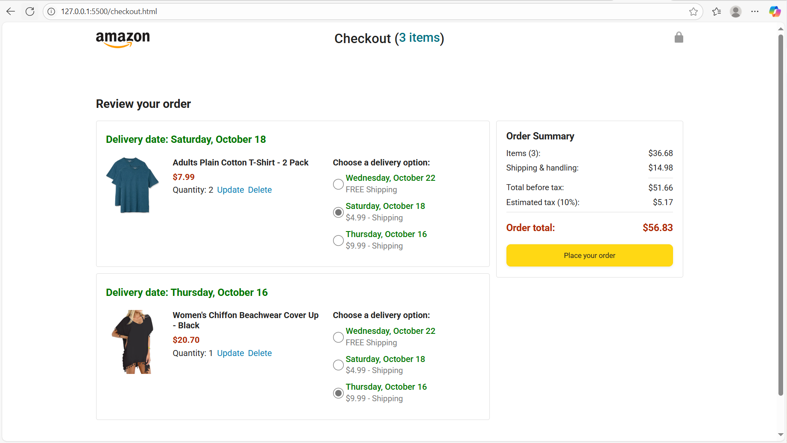
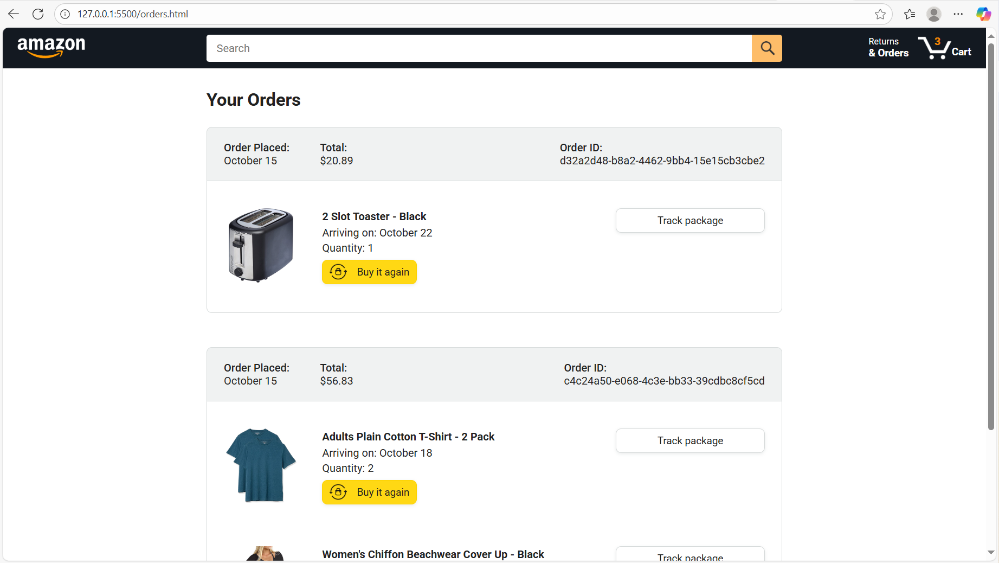
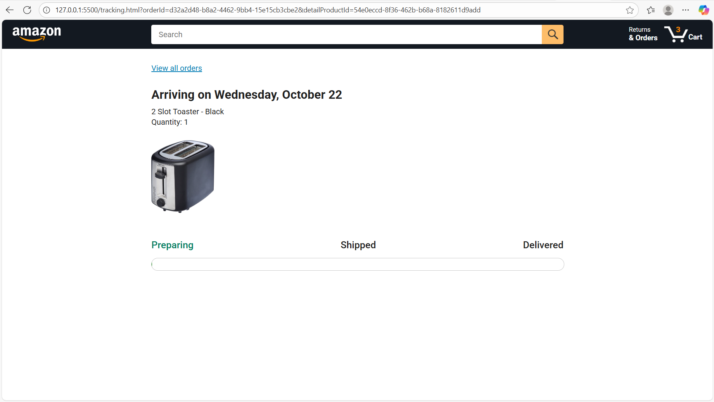

little eccomerce website, having some of the features real amazon has, to practice javascript  
doesnt have db, authorization, any security  
code is very messy  
might return to this project and finish it properly

---

to run, create folder, open in vscode:  
clone repo:  
`git clone https://github.com/Mansurwasd/Amazon_project.git`  
install requirements:  
`pip install -r requirements.txt`  
`npm install`  
go to backend folder, run:  
`uvicorn restfull_api:app --reload --port 8000`  
install live server in vscode and run it from amazon.html, or use any other way to localhost website

---

Screenshots

